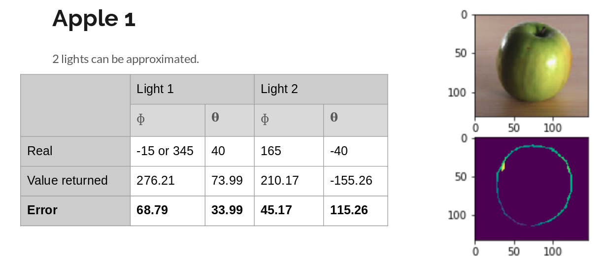
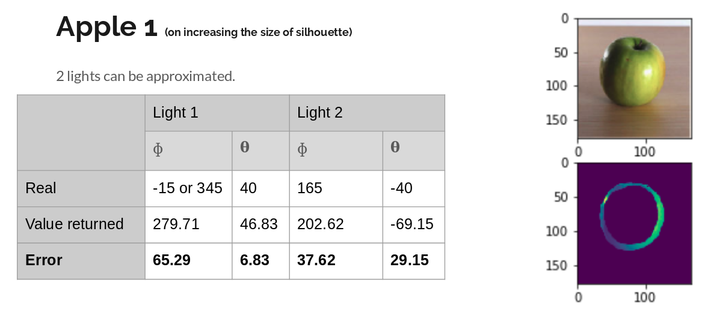
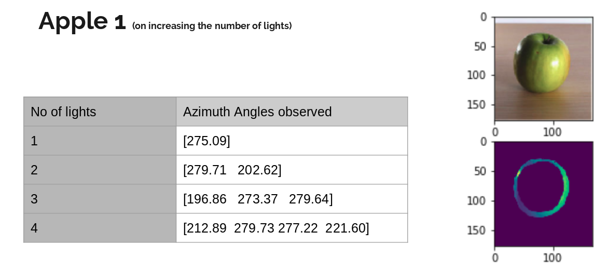
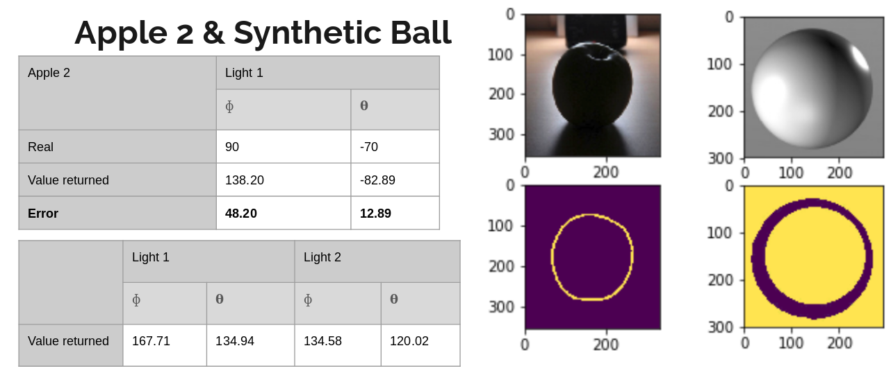

# Light Source Detection in Images
Finds out the azimuthal and zenith angles of all the ligths falling on an image taking assumptions of a Lambertian surface. It is a small replica of the paper on "Compositing Images through Light Source Detection". 

## Usage
* Inputs: 
    *  An RGB Image
    *  Silhouette in binary format (0: where it is not there otherwise 1)
    *  No of lights required

It will print the final azimuth and the zenith angle along with angles at every iteration. You can verify with the provided Jupyter Notebook where I have tested it on some examples. 

## Results
Some results are as follows:
* If the silhouette width is very less, then there is very high error.

* On increasing the width of the silhouette, the error decreases. It might be because of the weightage of the pixels inside.

* On increasing the number of lights, we can see that there's not much change and the results remain same.

* Other Results
